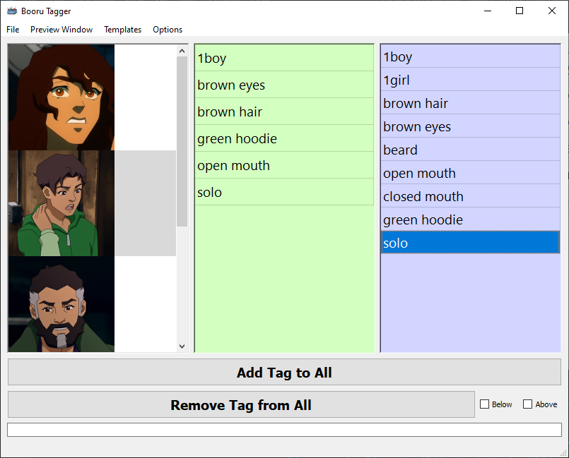
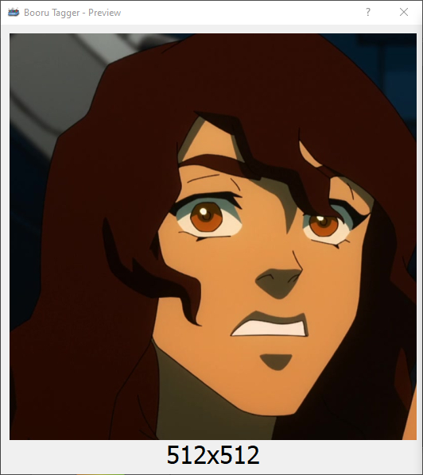
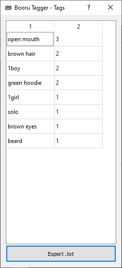
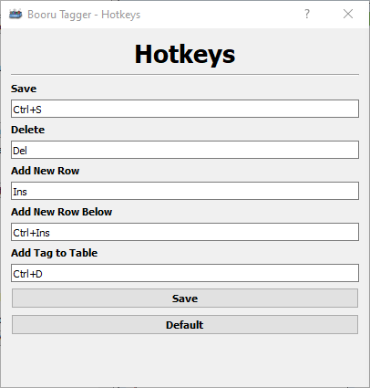

<h1 align="center">Booru Tagger</h1>

Simple application made in Python for tagging datasets using Booru-style tags.

## Features

* Image Preview
* Tag Frequency
* Hotkeys
* Template

## Main Window

- Thumbnail preview 
- Image Tags
- Used Tags
- Add tag to all images
- Remove individual tag from all files
- Remove from all tags from images above or below 

## Image Preview

- Image resized to 512 for preview
- Real dimensions displayed below image

## Tag Frequency

- Shows tag frequency
- Tags saved to "exported tags.txt"

## Hotkeys

- Currently you can only add, delete and save tags using hotkeys
- "Add Tag to Table" add a selected tag from the Used Tags panel to the Image Tags panel
- "Add New Row" adds a new empty row to the selected panel
- "Add New Row Below" adds a new empty row below the selected tag

## Template

- Open/Save tags from the Used Tags panel to a .tagger file.

## Default Hotkeys

- **Page Up:** Select image above
- **Page Down:** Select image below
- **Ctrl+S:** Save Image Tags
- **Ctrl+D:** Add tag from Used Tags to Image Tags
- **Delete:** Delete selected row
- **Insert:** Add new empty row to selected panel
- **Ctrl+Insert:** Add new empty row below the selected row

## Todo

- [ ] Add buttons to handle tags add/remove/save functions
- [ ] Add tag filters
- [ ] Add in-app image crop